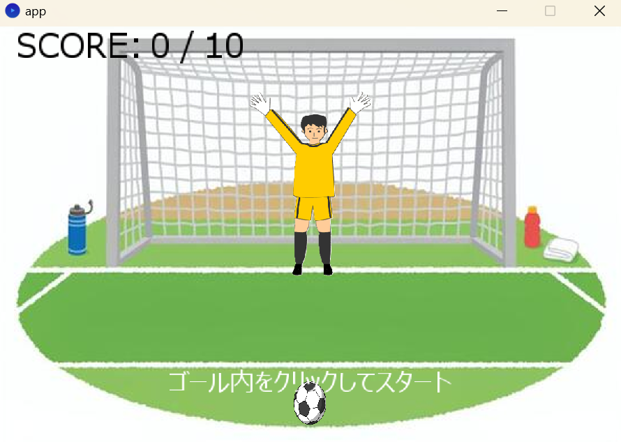
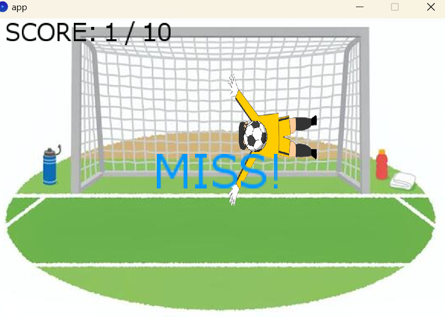
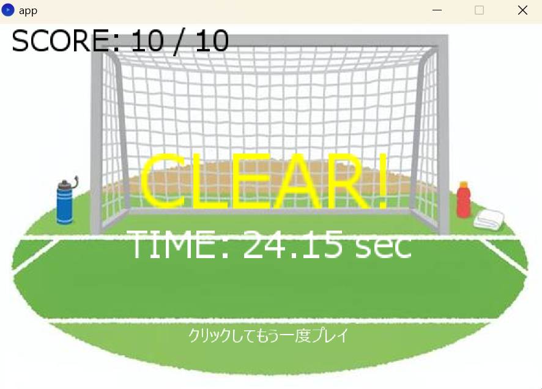

# 08

ソフトウェア工学Ⅱ
岡部亜沙美
田中壮汰
奥山颯大

# Soccer Shoot Challenge!

## 1. スタート画面  
ゲーム起動時に表示されるスタート画面です。  
難易度（Easy / Normal / Hard）を選択し、スタートボタンをクリックするとゲームが始まります。

  

---

## 2. ゲームプレイ画面（待機中）  
ゴールエリアをクリックすると、タイマーがスタートし、その位置に向かってボールが飛びます。

  

---

## 3. ゴール成功画面  
ボールがキーパーに当たらず、ゴールに入ると1点が加算されます。

  

---

## 4. ミス画面  
キーパーにボールが当たると、得点は加算されません。

  

---

## 5. クリア画面  
一定の得点に達するとゲームクリアとなり、クリアタイムが表示されます。

**難易度別クリア条件：**

- Easy：5点獲得  
- Normal：10点獲得  
- Hard：13点獲得

  

