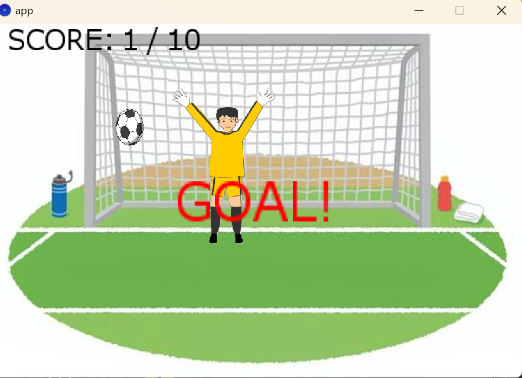
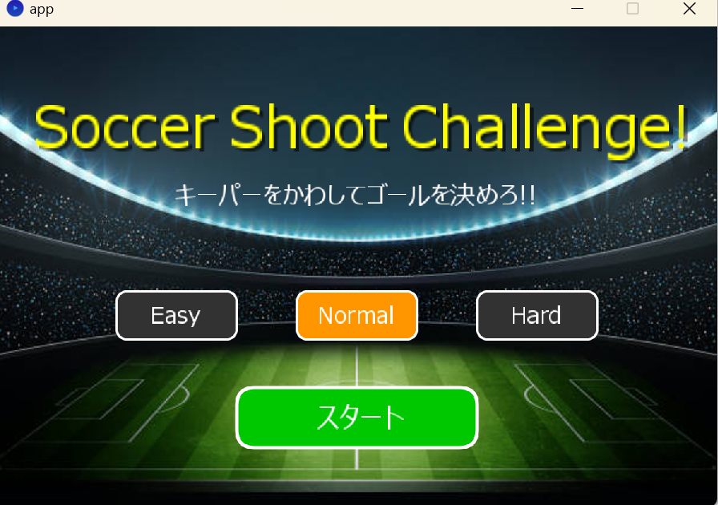

# 08

ソフトウェア工学Ⅱ
岡部亜沙美
田中壮汰
奥山颯大

# Soccer Shoot Challenge!

* このゲームは、サッカーのシュートを決めるゲームアプリです。

* 10点取ったらクリアで、クリアするまでのタイムを競います。

* サッカーゴール内をクリックすると、その場所にボールが飛んでいきます。

* その場所にキーパーが居なければ、1ポイント追加

* キーパーが居たら点数が追加されません。

* 点数が記録されていて、10点取ったらクリアとなります。

* クリア後に、スタートからクリアまでの所要時間が表示されます。

* 最初のクリックでタイマーがスタートします。

